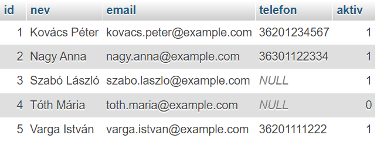
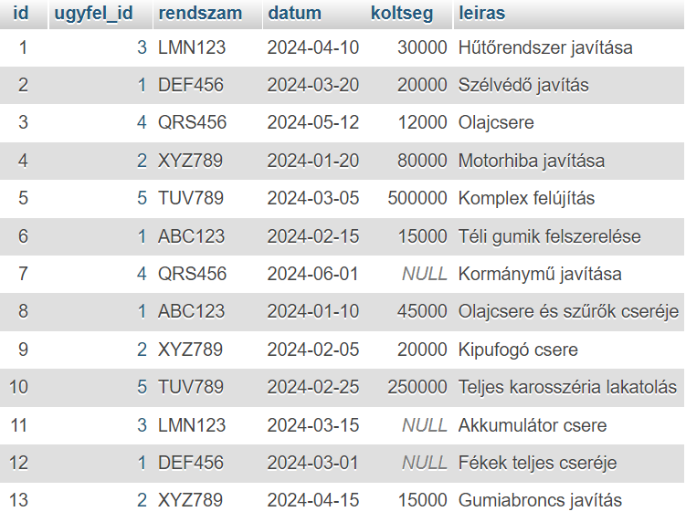
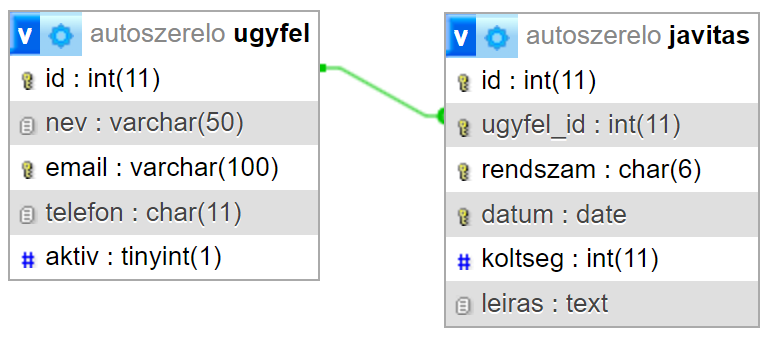

# 1. Autószerelő

Egy autószerelő műhely adatbázisa két táblából áll:
   - **Ugyfelek**: Az ügyfelek adatait tárolja.
   - **Javitasok**: Az ügyfelek autóinak javítási adatait tartalmazza.

Az `Ugyfel` és a `Javitas` tábla között `1:N` kapcsolat van, mivel egy ügyfélhez több megrendelés is tartozhat, de minden javítás egy konkrét ügyfélhez kell tartozzon.

## Adatok

A következő adatokat szeretnénk tárolni az adatbázisban:

<h3 align="center"> Ügyfelek </h3>
<p align="center">
    
</p>

<h3 align="center"> Javítások </h3>
<p align="center">
    
</p>

A táblák felépítése és közöttük a kapcsolatot az alábbi diagram szemlélteti:
<p align="center">
    
</p>

## Feladatok

1. Hozd létre az `Autoszerelo` adatbázist!
   
2. Készíts új táblát `Ugyfel` néven! A mezőket úgy alakítsd ki, hogy a megadott adatokat el tudjuk tárolni!
   - Az `id` mező legyen elsődleges kulcs!
   - A `nev` és az `email` mezők megadása kötelező!
   - Az `email` is kulcs a táblában!
   - Az `aktiv` attribútum jelöli, hogy az adott ügyfél autója jelenleg is a műhelyben van! Alapértelmezetten igaz értéket kap!
  
3. A `Javitas` tábla a teljesített megbízások adatait tartalmazza
   - Az `id` elsődleges kulcs a táblában!
   - Az `ugyfel_id` idegen kulcs, amely az `Ugyfel` tábla elsődleges kulcsára hivatkozik!
   - Kötelező megadni az ügyfél azonosítóját, az autó rendszámát és a dátumot minden megrendeléshez!
   - Egy ügyfélnek egy autójáról egy adott napra nem állítanak ki két számlát. Vagyis az említett attribútumok összetett kulcsot alkotnak!
   - Alapvetően egy autó megvizsgálása 12000 Ft (vizsgálati díj), de a javítás költsége nem haladja meg az 500000 Ft-ot. Ennek megfelelően ellenőrizzük a `koltseg` mező értékét!

4. Szúrd be az adatokat!
   
   **Ügyfél:**
    ```SQL
    'Kovács Péter', 'kovacs.peter@example.com', '36201234567', TRUE
    'Nagy Anna', 'nagy.anna@example.com', '36301122334', TRUE
    'Szabó László', 'szabo.laszlo@example.com', NULL, TRUE
    'Tóth Mária', 'toth.maria@example.com', NULL, FALSE
    'Varga István', 'varga.istvan@example.com', '36201111222', TRUE
    ```

    **Javítás:**
    ```SQL
    3, 'LMN123', '2024-04-10', 30000, 'Hűtőrendszer javítása'
    1, 'DEF456', '2024-03-20', 20000, 'Szélvédő javítás'
    4, 'QRS456', '2024-05-12', 12000, 'Olajcsere'
    2, 'XYZ789', '2024-01-20', 80000, 'Motorhiba javítása'
    5, 'TUV789', '2024-03-05', 500000, 'Komplex felújítás'
    1, 'ABC123', '2024-02-15', 15000, 'Téli gumik felszerelése'
    4, 'QRS456', '2024-06-01', NULL, 'Kormánymű javítása'
    1, 'ABC123', '2024-01-10', 45000, 'Olajcsere és szűrők cseréje'
    2, 'XYZ789', '2024-02-05', 20000, 'Kipufogó csere'
    5, 'TUV789', '2024-02-25', 250000, 'Teljes karosszéria lakatolás'
    3, 'LMN123', '2024-03-15', NULL, 'Akkumulátor csere'
    1, 'DEF456', '2024-03-01', NULL, 'Fékek teljes cseréje'
    2, 'XYZ789', '2024-04-15', 15000, 'Gumiabroncs javítás'
    ```

5. A `Javitas` táblához adj hozzá egy `statusz` mezőt, amely rövid (max 50 karakteres) szövegeket tárol!

6. Ellenőrizd, hogy a `Javitas` tábla `statusz` mezőjének csak az alábbi értékek egyikét adhassuk meg: "Folyamatban", "Befejezve", "Fizetve".

7. Az alapértelmezett `statusz` a "Folyamatban" legyen!

8. Töröld az `Ugyfel` táblából az `aktiv` mezőt!

9. Nevezd át az `Ugyfel` tábla `telefon` mezőjét `telefonszam`-ra!

10. Megszűnik az alapdíj a műhelyben, távolítsd el a hozzá tartozó megszorítást a `Javitas` táblából! (Tipp: használd az `information_schema` adatbázist)

11. Töröld a két táblát!
